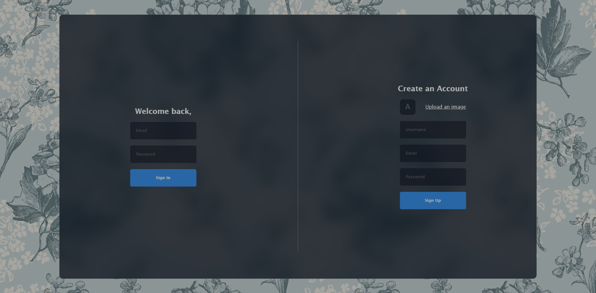
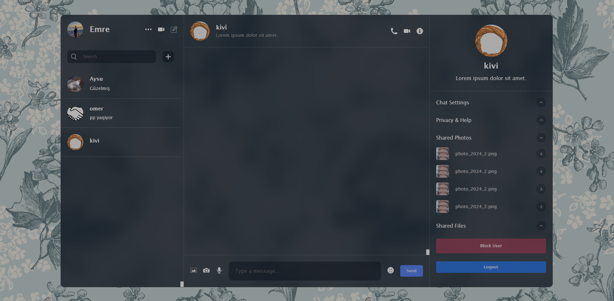

<div align="center">

  <h1 align="center">React Firebase Chat</h1>

  <p align="center">
    A real-time chat application built with React and Firebase
    <br />
    <a href="https://emrekoyuncuu.github.io/react-firebase-chat/" target="_blank">
      
    </a>
    <br />
    <br />
    <a href="https://github.com/emrekoyuncuu/react-firebase-chat/issues">Report Bug</a>
    ·
    <a href="https://github.com/emrekoyuncuu/react-firebase-chat/issues">Request Feature</a>
  </p>

  <div align="center">
    
    
    
    
  </div>
</div>

<br />

## 📋 Table of Contents

- [About The Project](#-about-the-project)
  - [Key Features](#key-features)
- [Built With](#️-built-with)
- [Getting Started](#-getting-started)
- [Usage](#-usage)
- [Roadmap](#️-roadmap)
- [Contributing](#-contributing)
- [Contact](#-contact)
- [Acknowledgements](#-acknowledgements)

## 🚀 About The Project

<div align="center">
  
  <p><em>Home Page View</em></p>
  
  
  <p><em>Messaging Interface</em></p>
</div>

React Firebase Chat is a modern, real-time chat application that allows users to communicate instantly. Built with React and powered by Firebase, it offers a seamless and responsive chatting experience. This project demonstrates the implementation of real-time database operations, user authentication, and responsive design in a web application.

### Key Features

- 🔐 **User Authentication**: Secure sign-up and login functionality using Firebase Auth
- 💬 **Real-time Messaging**: Instant message delivery and updates
- 👤 **User Profiles**: Customizable user avatars and display names
- 🌓 **Dark/Light Mode**: Toggle between themes for comfortable viewing
- 📱 **Responsive Design**: Optimized for both desktop and mobile devices
- 🔔 **Notifications**: Real-time notifications for new messages
- 🔒 **Data Security**: Firestore security rules to protect user data

## 🛠️ Built With

This project is built using these powerful technologies:

- [React](https://reactjs.org/)
- [Firebase](https://firebase.google.com/)
- [TypeScript](https://www.typescriptlang.org/)
- [Styled Components](https://styled-components.com/)

## 🏁 Getting Started

To get a local copy up and running, follow these simple steps:

1. Clone the repository
   ``sh
   git clone https://github.com/emrekoyuncuu/react-firebase-chat.git
   ``
2. Navigate to the project directory
   ``sh
   cd react-firebase-chat
   ``
3. Install dependencies
   ``sh
   npm install
   ``
4. Set up your Firebase configuration
   - Create a Firebase project and obtain your config
   - Create a `.env` file in the root directory
   - Add your Firebase config to the `.env` file:
     ```
     REACT_APP_FIREBASE_API_KEY=your_api_key
     REACT_APP_FIREBASE_AUTH_DOMAIN=your_auth_domain
     REACT_APP_FIREBASE_PROJECT_ID=your_project_id
     REACT_APP_FIREBASE_STORAGE_BUCKET=your_storage_bucket
     REACT_APP_FIREBASE_MESSAGING_SENDER_ID=your_messaging_sender_id
     REACT_APP_FIREBASE_APP_ID=your_app_id
     ```
5. Start the development server
   ``sh
   npm start
   ``
6. Open [http://localhost:3000](http://localhost:3000) in your browser to see the application

## 💻 Usage

1. Sign up for an account or log in if you already have one
2. Start a new conversation or continue an existing one
3. Send messages in real-time
4. Customize your profile and settings as needed

## 🗺️ Roadmap

See the [open issues](https://github.com/emrekoyuncuu/react-firebase-chat/issues) for a list of proposed features and known issues.

## 🤝 Contributing

Contributions are what make the open-source community such an amazing place to learn, inspire, and create. Any contributions you make are **greatly appreciated**.

1. Fork the Project
2. Create your Feature Branch (`git checkout -b feature/AmazingFeature`)
3. Commit your Changes (`git commit -m 'Add some AmazingFeature'`)
4. Push to the Branch (`git push origin feature/AmazingFeature`)
5. Open a Pull Request

## 📧 Contact

Emre Koyuncu - [LinkedIn](https://www.linkedin.com/in/emrekoyuncuu/) - emrekoyuncujob@gmail.com

Project Link: [https://github.com/emrekoyuncuu/react-firebase-chat](https://github.com/emrekoyuncuu/react-firebase-chat)

## 🙏 Acknowledgements

- [React Documentation](https://reactjs.org/docs/getting-started.html)
- [Firebase Documentation](https://firebase.google.com/docs)
- [TypeScript Documentation](https://www.typescriptlang.org/docs/)
- [Styled Components Documentation](https://styled-components.com/docs)
- [React Icons](https://react-icons.github.io/react-icons/)
- [Img Shields](https://shields.io)

<div align="center">
  Made with ❤️ by <a href="https://github.com/emrekoyuncuu">Emre Koyuncu</a>
</div>